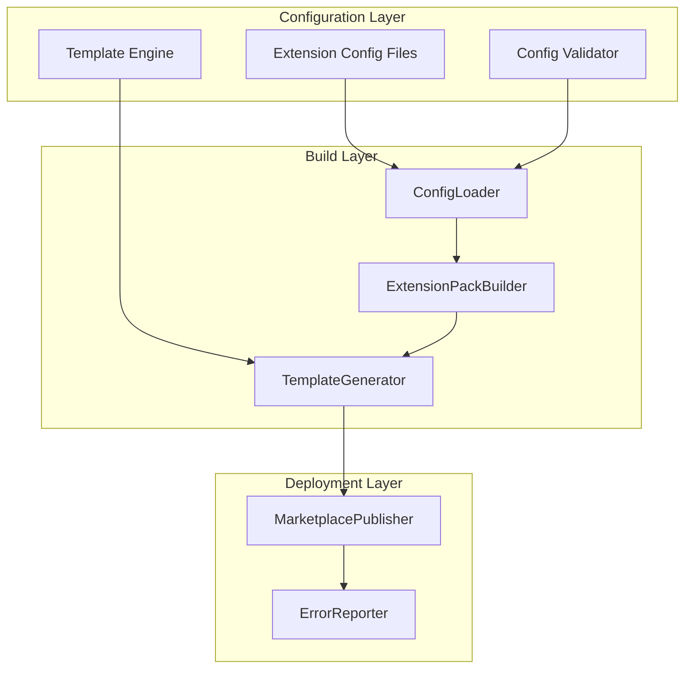

# Low Level Design: VSCode Extension Pack Builder

## Document Information

- **Document Type**: Low Level Design (LLD)
- **Task Type**: task
- **Version**: 1.0.0
- **Created**: 2025-10-30
- **Updated**: 2025-10-30
- **Target Stack**: TypeScript, Node.js, VSCode Extension API

## Executive Summary

This document defines the technical architecture for a VSCode Extension Pack Builder tool that generates and publishes extension packs for different programming languages (TypeScript, C++, Python, Go, etc.) based on TypeScript configuration files that already exist in the project.

**Current State**: The project contains TypeScript configuration files (`scripts/configs/collections/{vscode|vscodium}/*.ts`) that define:

- Lists of required/optional extensions for each language
- Custom snippets for the language
- Workspace settings
- Keybindings
- Documentation (setup guides, troubleshooting)

**Goal**: Create a clean build and deployment system that:

1. Reads these TypeScript configuration files
2. Generates VSCode/VSCodium extension pack files (package.json, README, snippets, etc.)
3. Packages them into .vsix files
4. Publishes them to VSCode Marketplace and/or Open VSX Registry with transparent error reporting

## Architecture Overview

### System Components



### Core Modules

1. **ConfigLoader** (`src/config/`) - Loads and validates TypeScript config files
2. **ExtensionPackBuilder** (`src/build/`) - Orchestrates extension pack generation
3. **TemplateGenerator** (`src/build/`) - Renders templates using Handlebars
4. **MarketplacePublisher** (`src/publish/`) - Publishes .vsix files to marketplaces
5. **ErrorReporter** (`src/publish/`) - Formats and reports errors with actionable guidance

## Existing Extension Configurations

### Configuration File Locations

The project already contains TypeScript configuration files organized as follows:

```plaintext
scripts/configs/
├── collections/              ← Extension pack definitions
│   ├── vscode/              ← VSCode marketplace versions
│   │   ├── cpp.ts
│   │   ├── csharp.ts
│   │   ├── generic-essential.ts
│   │   ├── generic-extended.ts
│   │   ├── godot.ts
│   │   ├── golang.ts
│   │   ├── javascript.ts
│   │   ├── python.ts
│   │   └── typescript.ts
│   └── vscodium/            ← VSCodium (Open VSX) versions
│       ├── cpp.ts
│       ├── csharp.ts
│       ├── generic-essential.ts
│       ├── generic-extended.ts
│       ├── godot.ts
│       ├── golang.ts
│       ├── javascript.ts
│       ├── python.ts
│       └── typescript.ts
├── extensions/              ← Individual extension definitions
│   ├── ai/                  ← AI/Copilot extensions
│   ├── api/                 ← REST/OpenAPI extensions
│   ├── cpp/                 ← C++ language extensions
│   ├── csharp/              ← C# language extensions
│   ├── cvs/                 ← Git/GitHub/GitLab extensions
│   ├── docker/              ← Docker/containers extensions
│   ├── godot/               ← Godot game engine extensions
│   ├── golang/              ← Go language extensions
│   ├── javascript/          ← JavaScript/Node/Deno extensions
│   ├── kubernetes/          ← Kubernetes extensions
│   ├── productivity/        ← General productivity extensions
│   ├── python/              ← Python language extensions
│   └── typescript/          ← TypeScript language extensions
└── shared/
    └── types.ts             ← TypeScript interfaces (Collection, Extension, etc.)
```

### Extension, Settings, and Snippets Inventory

For detailed information about existing configurations, see the following reference files:

- **[existing-extensions.json](existing-extensions.json)** - Complete inventory of all extensions by language
  - Extension IDs, names, publishers, licenses
  - Required vs optional extensions per language
  - Why each extension is included
  - Generic essential and extended extension lists

- **[existing-settings.json](existing-settings.json)** - VSCode settings configurations
  - Language-specific settings (C++, Python, Go, etc.)
  - Editor configurations (formatting, linting, etc.)
  - Tool configurations (clangd, Black, gopls, etc.)
  - Generic essential and extended settings

- **[existing-snippets.json](existing-snippets.json)** - Code snippet patterns
  - Snippet prefixes and descriptions
  - Common patterns per language
  - Snippet design principles
  - Tab completion patterns

These JSON files serve as reference documentation for:

1. Understanding current extension pack configurations
2. Maintaining consistency when adding new languages
3. Documenting the rationale behind extension choices
4. Providing examples for configuration transformations

### Migration Notes

**Current Implementation Issues (to be addressed):**

1. **Build Script Problems**: Current `scripts/generate-extension.ts` has design flaws - will be fully rewritten
2. **Publish Script Reliability**: `scripts/publish-extensions.sh` is inconsistent - will be fully rewritten
3. **Error Reporting**: Lack of transparent error messages for failures
4. **Architecture**: Overall design needs refactoring

**New System Requirements:**

1. Load existing TypeScript configs without modification
2. Transform Collection interface to VSCode package.json format
3. **Preserve version field from existing package.json when rebuilding extensions**
4. Generate all required files (README, snippets, settings)
5. Copy logo from `logos/` directory to extension package
6. Package into .vsix files reliably
7. Publish with clear error messages indicating exact problems and solutions
8. Version management handled by `dragoscops/version-update@v3` GitHub Action

**Note**: Existing templates in `templates/` directory can be reused, but the build system is a complete rewrite.

## Data Structures & Interfaces

### Existing Configuration Format (from current codebase)

The project already uses this TypeScript configuration structure:

```typescript
// scripts/configs/shared/types.ts (existing)
export interface Collection {
  description: string;
  tags: string[];
  required_extensions: Extension[];
  optional_extensions: Extension[];
  settings: Record<string, Setting>;
  snippets: Snippet[];
  documentation: Documentation;
}

export interface Extension {
  id: string; // e.g., 'llvm-vs-code-extensions.vscode-clangd'
  name: string;
  description: string;
  publisher: string;
  license: string;
  marketplace_url?: string;
  why_required?: string; // Why this extension is included
  why_recommended?: string;
}

export interface Setting {
  value: unknown;
  description: string;
  scope: 'user' | 'workspace';
}

export interface Snippet {
  name: string;
  prefix: string;
  description: string;
  body: string | string[];
}

export interface Documentation {
  setup_guide: string; // Markdown content
  troubleshooting: string; // Markdown content
}
```

### Generated Extension Pack Structure

The build system transforms the above into VSCode extension pack format:

```typescript
// Generated package.json structure
interface VSCodePackageJson {
  name: string; // e.g., 'tpl-vscode-cpp'
  displayName: string; // e.g., 'Templ C++ Extension Pack'
  description: string; // From Collection.description
  version: string; // Managed separately
  publisher: string; // e.g., 'templ-project'
  repository: RepositoryInfo;
  engines: { vscode: string };
  categories: ['Extension Packs'];
  keywords: string[]; // From Collection.tags

  // Extension pack definition
  extensionPack: string[]; // IDs from required_extensions + optional_extensions

  // Contributions (if any custom settings)
  contributes?: {
    configuration?: ConfigurationContribution;
    snippets?: SnippetContribution[];
  };
}
```

### Configuration File Examples

#### Current TypeScript Configuration (Input)

```typescript
// scripts/configs/collections/vscode/cpp.ts (existing file)
import { clangd, cmake, clangFormat } from '../../extensions/cpp';
import { Collection } from '../../shared/types';

export const cpp: Collection = {
  description: 'Essential C/C++ development environment for VSCode',
  tags: ['cpp', 'c++', 'clang', 'cmake'],

  required_extensions: [clangd, cmake, clangFormat],
  optional_extensions: [],

  settings: {
    'clangd.path': {
      value: 'clangd',
      description: 'Path to clangd executable',
      scope: 'workspace'
    },
    '[cpp]': {
      value: {
        'editor.defaultFormatter': 'xaver.clang-format',
        'editor.formatOnSave': true
      },
      description: 'C++ specific editor settings',
      scope: 'workspace'
    }
  },

  snippets: [
    {
      name: 'class',
      prefix: 'class',
      description: 'C++ class template',
      body: [
        'class ${1:ClassName} {',
        'public:',
        '    ${1:ClassName}();',
        '};'
      ]
    }
  ],

  documentation: {
    setup_guide: '# C++ Setup Guide\n...',
    troubleshooting: '# Troubleshooting\n...'
  }
};
```

## Module Implementation Details

### 1. Configuration Loader Module

**Purpose**: Load and parse existing TypeScript configuration files from `scripts/configs/collections/`

**Dependencies**: Pino (logging)

```typescript
// src/config/ConfigLoader.ts
import pino from 'pino';

export class ConfigLoader {
  private logger: pino.Logger;

  constructor(parentLogger: pino.Logger) {
    this.logger = parentLogger.child({ module: 'ConfigLoader' });
  }

  // Key methods:
  // - loadCollection(ide: 'vscode'|'vscodium', language: string): Promise<Collection>
  //   Dynamically imports TypeScript files from scripts/configs/collections/{ide}/{language}.ts
  //   Returns the Collection object for that language
  //   Logs: info on successful load, error on failure
  //
  // - listAvailableCollections(ide?: string): Promise<string[]>
  //   Scans the configs directory and returns available language configs
  //   e.g., ['cpp', 'typescript', 'python', 'golang', 'javascript']
  //   Logs: debug with found collections
  //
  // - validateCollection(collection: Collection): ValidationResult
  //   Basic validation using TypeScript schema validation (e.g., zod, io-ts, or yup)
  //   Ensures required fields exist, extension IDs are valid format
  //   Logs: warn for validation issues, error for critical failures
  //
  // Validation Rules:
  // - Extension IDs must match pattern: /^[a-z0-9-]+\.[a-z0-9-]+$/
  // - Required extensions array cannot be empty
  // - Settings values must be serializable to JSON
  // - Snippet bodies must be non-empty strings or arrays
  // - Documentation fields must be non-empty strings

  // Implementation Notes:
  // - Use dynamic import() to load TypeScript files at runtime
  // - Support both default exports and named exports
  // - Cache loaded collections to avoid re-importing
  // - Use pino child logger for all logging operations
}
```

### 2. Build System Module

**Purpose**: Transform Collection config into VSCode extension pack files

**Dependencies**: Pino (logging), Handlebars (templating)

```typescript
// src/build/ExtensionPackBuilder.ts
import pino from 'pino';

export class ExtensionPackBuilder {
  private logger: pino.Logger;

  constructor(parentLogger: pino.Logger) {
    this.logger = parentLogger.child({ module: 'ExtensionPackBuilder' });
  }

  // Build Pipeline:
  // 1. Load Collection from config file
  // 2. Read existing package.json (if exists) to preserve version number
  // 3. Generate package.json with extension pack definition (using preserved version)
  // 4. Generate README.md from documentation fields
  // 5. Generate snippets/{language}.json from snippets array
  // 6. Generate settings.json (if needed) for default settings
  // 7. Copy icon from logos/ directory (e.g., logos/cpp-logo.png -> icon.png)
  // 8. Generate CHANGELOG.md
  // 9. Create extension.ts entry point (minimal, extension packs don't need much code)
  // 10. Package into .vsix using @vscode/vsce
  //
  // Logs at each step: info for progress, error for failures, debug for details
  //
  // CRITICAL: Version Preservation
  // - Before regenerating files, check if packages/{ide}/{language}/package.json exists
  // - If exists, read and preserve the "version" field
  // - Use preserved version when generating new package.json
  // - If package.json doesn't exist, use default version (e.g., "0.0.1")
  // - This prevents losing version information when rebuilding extensions
  // - dragoscops/version-update@v3 will handle version increments, we just preserve what's there

  // Key Transformations:
  // Collection.required_extensions + optional_extensions -> package.json.extensionPack[]
  // Collection.description -> package.json.description
  // Collection.tags -> package.json.keywords
  // Collection.documentation.setup_guide + troubleshooting -> README.md
  // Collection.snippets[] -> snippets/{language}.json
  // Collection.settings -> settings.json contribution
  // logos/{language}-logo.png -> icon.png
  // PRESERVE: version field from existing package.json (if exists)

  // Output Structure:
  // packages/{ide}/{language}/
  //   ├── package.json
  //   ├── README.md
  //   ├── CHANGELOG.md
  //   ├── LICENSE.md
  //   ├── icon.png          ← Copied from logos/
  //   ├── src/
  //   │   └── extension.ts
  //   ├── snippets/
  //   │   └── {language}.json
  //   └── settings.json (optional)

  // Error Handling:
  // - ConfigurationError: Invalid collection data
  // - BuildError: File generation or copying failures
  // - PackagingError: .vsix creation failures
  // All errors logged with pino.error() and include actionable guidance
}

// src/build/TemplateGenerator.ts
import pino from 'pino';
import Handlebars from 'handlebars';

export class TemplateGenerator {
  private logger: pino.Logger;

  constructor(parentLogger: pino.Logger) {
    this.logger = parentLogger.child({ module: 'TemplateGenerator' });
  }

  // Generates files from templates using Handlebars
  // Templates include:
  // - package.json.hbs
  // - README.md.hbs
  // - CHANGELOG.md.hbs
  // - extension.ts.hbs
  //
  // Context passed to templates includes Collection data plus metadata like version, publisher, etc.
  // Logs: debug for template rendering, error for rendering failures
}
```

### 3. Publishing System Module

**Purpose**: Publish .vsix files to VSCode Marketplace and/or Open VSX Registry with transparent error reporting

**Dependencies**: Pino (logging), @vscode/vsce, ovsx

```typescript
// src/publish/MarketplacePublisher.ts
import pino from 'pino';

export class MarketplacePublisher {
  private logger: pino.Logger;

  constructor(parentLogger: pino.Logger) {
    this.logger = parentLogger.child({ module: 'MarketplacePublisher' });
  }

  // Publishing Flow:
  // 1. Read marketplace configuration (token, target marketplace)
  // 2. Validate .vsix file exists and is valid
  // 3. Attempt publication to each configured marketplace
  // 4. Report results with clear success/failure messages
  // 5. Log all operations with pino (info for progress, error for failures)

  // Supported Marketplaces:
  // - VSCode Marketplace (marketplace.visualstudio.com) - uses @vscode/vsce
  // - Open VSX Registry (open-vsx.org) - uses ovsx CLI

  // Error Reporting Requirements:
  // - Clear error messages for common issues:
  //   * Authentication failures -> "Token invalid or expired. Get new token from: [URL]"
  //   * Version conflicts -> "Version X.Y.Z already published. Increment version in package.json"
  //   * Network errors -> "Connection failed. Check internet connection and marketplace status"
  //   * Validation errors -> "Extension validation failed: [specific field/issue]"
  // - Exit codes: 0 (success), 1 (partial failure), 2 (complete failure)
  // - Summary report showing which marketplaces succeeded/failed

  // Error Categories:
  // - AuthenticationError: Token invalid, expired, or insufficient permissions
  // - NetworkError: Connection timeout, DNS failure, marketplace unavailable
  // - ValidationError: Invalid package.json, missing required fields, malformed .vsix
  // - VersionConflictError: Version already exists on marketplace
  // - PublishError: Generic publishing failure with marketplace-specific details
}

// src/publish/ErrorReporter.ts
import pino from 'pino';

export class ErrorReporter {
  private logger: pino.Logger;

  constructor(parentLogger: pino.Logger) {
    this.logger = parentLogger.child({ module: 'ErrorReporter' });
  }

  // Transparent Error Reporting:
  //
  // Format errors into user-friendly messages with:
  // - Clear problem statement
  // - Specific cause (auth, network, validation, etc.)
  // - Actionable solution steps
  // - Relevant URLs for documentation
  //
  // Example output:
  // ❌ Failed to publish to VSCode Marketplace
  //    Problem: Authentication failed
  //    Cause: Personal access token is invalid or expired
  //    Solution: Generate a new PAT at https://marketplace.visualstudio.com/manage
  //              Set token: export VSCODE_TOKEN=<your-token>
  //
  // Log levels:
  // - INFO: Normal progress updates
  // - WARN: Non-fatal issues (already published, skipped)
  // - ERROR: Fatal errors with remediation steps
  //
  // All errors logged to pino with structured data for debugging
}
```

### 4. Task Orchestration

**Purpose**: Use Taskfile for build and publish orchestration

**Tool**: [Task](https://taskfile.dev/) - Modern task runner / build tool

```yaml
# Taskfile.yml
version: '3'

tasks:
  # Unitary tasks
  build:cpp:vscode:
    desc: Build C++ extension pack for VSCode
    cmds:
      - node src/index.js build vscode cpp --output ./dist/vscode

  build:typescript:vscode:
    desc: Build TypeScript extension pack for VSCode
    cmds:
      - node src/index.js build vscode typescript --output ./dist/vscode

  build:python:vscode:
    desc: Build Python extension pack for VSCode
    cmds:
      - node src/index.js build vscode python --output ./dist/vscode

  # ... (similar for other languages and vscodium)

  # Composite tasks
  build:all:vscode:
    desc: Build all VSCode extension packs
    deps:
      - build:cpp:vscode
      - build:typescript:vscode
      - build:python:vscode
      - build:golang:vscode
      - build:javascript:vscode
      - build:csharp:vscode
      - build:godot:vscode
      - build:generic-essential:vscode
      - build:generic-extended:vscode

  build:all:vscodium:
    desc: Build all VSCodium extension packs
    deps:
      - build:cpp:vscodium
      - build:typescript:vscodium
      - build:python:vscodium
      - build:golang:vscodium
      - build:javascript:vscodium
      - build:csharp:vscodium
      - build:godot:vscodium
      - build:generic-essential:vscodium
      - build:generic-extended:vscodium

  build:all:
    desc: Build all extension packs (VSCode + VSCodium)
    deps:
      - build:all:vscode
      - build:all:vscodium

  # Publishing tasks
  publish:vscode:
    desc: Publish all VSCode extension packs to VSCode Marketplace
    cmds:
      - node src/index.js publish dist/vscode/*.vsix --marketplace vscode

  publish:vscodium:
    desc: Publish all VSCodium extension packs to Open VSX
    cmds:
      - node src/index.js publish dist/vscodium/*.vsix --marketplace openvsx

  publish:all:
    desc: Publish all extension packs to all marketplaces
    deps:
      - publish:vscode
      - publish:vscodium

  # Testing tasks
  test:
    desc: Run all tests
    cmds:
      - npm test

  # Utility tasks
  clean:
    desc: Clean build artifacts
    cmds:
      - rm -rf dist/ packages/
      - find . -name "*.vsix" -delete
```

**CLI Interface**:

```typescript
// src/index.ts - Main entry point
import pino from 'pino';

// Simple CLI that accepts:
// - build <ide> <language> [--output <dir>]
// - publish <vsix-pattern> --marketplace <name>
//
// Most orchestration done via Taskfile, not complex CLI framework
// Use minimist or yargs for basic argument parsing

const logger = pino({
  level: process.env.LOG_LEVEL || 'info',
  transport: {
    target: 'pino-pretty',
    options: {
      colorize: true
    }
  }
});

// Create child loggers for each module
const configLoader = new ConfigLoader(logger);
const builder = new ExtensionPackBuilder(logger);
const publisher = new MarketplacePublisher(logger);
```

## Error Handling Strategy

### Error Classification and Reporting

The system uses a transparent error classification system focused on actionable user guidance:

```typescript
// Error Categories:
// 1. ConfigurationError - Missing or invalid TypeScript config file
//    Example: "Configuration file not found: scripts/configs/collections/vscode/cpp.ts"
//    Action: "Check that the file exists and is properly exported"
//    Logged with: logger.error({ err, configPath }, 'Configuration load failed')
//
// 2. ValidationError - Invalid extension format or missing required fields
//    Example: "Invalid extension ID format: 'invalid-id'"
//    Action: "Extension IDs must be in format: publisher.extension-name"
//    Logged with: logger.error({ err, extensionId }, 'Validation failed')
//
// 3. BuildError - File system, template rendering, or packaging failures
//    Example: "Failed to generate package.json"
//    Action: "Check write permissions in output directory"
//    Logged with: logger.error({ err, outputPath }, 'Build operation failed')
//
// 4. AssetError - Missing or invalid logo/asset files
//    Example: "Logo not found: logos/cpp-logo.png"
//    Action: "Ensure logo file exists in logos/ directory"
//    Logged with: logger.error({ err, assetPath }, 'Asset operation failed')
//
// 5. PublishError - Authentication, network, or marketplace API errors
//    Example: "Authentication failed: Invalid token"
//    Action: "Get new token from https://marketplace.visualstudio.com/manage"
//    Logged with: logger.error({ err, marketplace }, 'Publish operation failed')
//
// 6. NetworkError - Connection timeouts, DNS failures
//    Example: "Connection timeout when reaching marketplace.visualstudio.com"
//    Action: "Check internet connection and marketplace status"
//    Logged with: logger.error({ err, url }, 'Network request failed')
//
// 7. VersionConflictError - Version already published
//    Example: "Version 1.0.0 already exists on VSCode Marketplace"
//    Action: "Version managed by dragoscops/version-update@v3 GitHub Action"
//    Note: "This error should not occur in normal CI/CD workflow"
//    Logged with: logger.error({ err, version }, 'Version conflict detected')

// Error Output Format:
// ❌ Error: {Clear problem statement}
//    Cause: {Specific technical cause}
//    Fix: {Step-by-step remediation}
//    Docs: {Relevant documentation URL}
//
// All errors use pino structured logging for debugging:
// logger.error({
//   err: error,
//   context: { ...relevant context... },
//   errorType: 'ConfigurationError' | 'BuildError' | etc.
// }, 'Operation failed')
```

## CI/CD Pipeline Integration

### GitHub Actions Workflow

**Version Management**: Handled by `dragoscops/version-update@v3` GitHub Action - automatically increments versions only for changed extensions plus root folder.

```yaml
# .github/workflows/build-and-publish.yml
name: Build and Publish Extension Packs

on:
  push:
    branches: [main]
  pull_request:
  workflow_dispatch:

jobs:
  version:
    name: Update Versions
    runs-on: ubuntu-latest
    if: github.ref == 'refs/heads/main'
    steps:
      - uses: actions/checkout@v4
        with:
          fetch-depth: 0

      - name: Update versions for changed extensions
        uses: dragoscops/version-update@v3
        with:
          # Automatically detects changed extension packages
          # Increments version only for modified extensions
          # Updates root package.json if any extension changed
          strategy: 'smart' # Only bump changed extensions

  build:
    name: Build Extension Packs
    runs-on: ubuntu-latest
    needs: [version]
    if: always()
    steps:
      - uses: actions/checkout@v4

      - name: Setup Node.js
        uses: actions/setup-node@v4
        with:
          node-version: '20'
          cache: 'npm'

      - name: Install dependencies
        run: npm ci

      - name: Install Task
        run: |
          sh -c "$(curl --location https://taskfile.dev/install.sh)" -- -d -b /usr/local/bin

      - name: Build all extension packs
        run: task build:all

      - name: Upload build artifacts
        uses: actions/upload-artifact@v4
        with:
          name: extension-packs
          path: dist/**/*.vsix
          retention-days: 30

  test:
    name: Run Tests
    runs-on: ubuntu-latest
    steps:
      - uses: actions/checkout@v4

      - name: Setup Node.js
        uses: actions/setup-node@v4
        with:
          node-version: '20'
          cache: 'npm'

      - name: Install dependencies
        run: npm ci

      - name: Run tests
        run: npm test

  publish:
    name: Publish to Marketplaces
    needs: [build, test]
    runs-on: ubuntu-latest
    if: github.ref == 'refs/heads/main'
    steps:
      - uses: actions/checkout@v4

      - name: Download build artifacts
        uses: actions/download-artifact@v4
        with:
          name: extension-packs
          path: dist

      - name: Install Task
        run: |
          sh -c "$(curl --location https://taskfile.dev/install.sh)" -- -d -b /usr/local/bin

      - name: Publish all extension packs
        env:
          VSCODE_TOKEN: ${{ secrets.VSCODE_MARKETPLACE_TOKEN }}
          OPENVSX_TOKEN: ${{ secrets.OPENVSX_TOKEN }}
        run: task publish:all
```

### Environment Setup

Required secrets in GitHub repository:

- `VSCODE_MARKETPLACE_TOKEN` - Personal Access Token for VS Code Marketplace
- `OPENVSX_TOKEN` - Personal Access Token for Open VSX Registry

Token creation guides:

- VSCode Marketplace: <https://code.visualstudio.com/api/working-with-extensions/publishing-extension#get-a-personal-access-token>
- Open VSX: <https://github.com/eclipse/openvsx/wiki/Publishing-Extensions>

## Testing Strategy

### Test Coverage

Minimal happy path tests to ensure core functionality works:

```typescript
// tests/config/ConfigLoader.test.ts
describe('ConfigLoader', () => {
  test('loads valid cpp collection for vscode', async () => {
    const loader = new ConfigLoader(logger);
    const collection = await loader.loadCollection('vscode', 'cpp');

    expect(collection.description).toBeDefined();
    expect(collection.required_extensions.length).toBeGreaterThan(0);
  });

  test('validates collection with valid data', () => {
    const loader = new ConfigLoader(logger);
    const result = loader.validateCollection(validCppCollection);

    expect(result.isValid).toBe(true);
    expect(result.errors).toHaveLength(0);
  });

  test('rejects invalid extension ID format', () => {
    const loader = new ConfigLoader(logger);
    const invalidCollection = { ...validCollection, required_extensions: [{ id: 'invalid' }] };
    const result = loader.validateCollection(invalidCollection);

    expect(result.isValid).toBe(false);
    expect(result.errors[0]).toContain('Extension ID must match pattern');
  });
});

// tests/build/ExtensionPackBuilder.test.ts
describe('ExtensionPackBuilder', () => {
  test('builds cpp extension pack successfully', async () => {
    const builder = new ExtensionPackBuilder(logger);
    const result = await builder.build('vscode', 'cpp', './test-output');

    expect(result.success).toBe(true);
    expect(fs.existsSync('./test-output/vscode/cpp/package.json')).toBe(true);
    expect(fs.existsSync('./test-output/vscode/cpp/icon.png')).toBe(true);
  });

  test('copies logo from logos directory', async () => {
    const builder = new ExtensionPackBuilder(logger);
    await builder.build('vscode', 'cpp', './test-output');

    const iconPath = './test-output/vscode/cpp/icon.png';
    expect(fs.existsSync(iconPath)).toBe(true);
    expect(fs.statSync(iconPath).size).toBeGreaterThan(0);
  });

  test('generates valid package.json', async () => {
    const builder = new ExtensionPackBuilder(logger);
    await builder.build('vscode', 'typescript', './test-output');

    const pkg = JSON.parse(fs.readFileSync('./test-output/vscode/typescript/package.json', 'utf-8'));
    expect(pkg.name).toBeDefined();
    expect(pkg.extensionPack).toBeInstanceOf(Array);
    expect(pkg.extensionPack.length).toBeGreaterThan(0);
  });

  test('preserves existing version when rebuilding', async () => {
    const builder = new ExtensionPackBuilder(logger);

    // Create initial package.json with version 1.2.3
    fs.mkdirSync('./test-output/vscode/python', { recursive: true });
    fs.writeFileSync(
      './test-output/vscode/python/package.json',
      JSON.stringify({ name: 'test', version: '1.2.3' })
    );

    // Rebuild the extension
    await builder.build('vscode', 'python', './test-output');

    // Version should be preserved
    const pkg = JSON.parse(fs.readFileSync('./test-output/vscode/python/package.json', 'utf-8'));
    expect(pkg.version).toBe('1.2.3');
  });

  test('uses default version for new extensions', async () => {
    const builder = new ExtensionPackBuilder(logger);

    // Build brand new extension (no existing package.json)
    await builder.build('vscode', 'golang', './test-output-new');

    const pkg = JSON.parse(fs.readFileSync('./test-output-new/vscode/golang/package.json', 'utf-8'));
    expect(pkg.version).toBe('0.0.1'); // Default version
  });
});

// tests/build/TemplateGenerator.test.ts
describe('TemplateGenerator', () => {
  test('renders package.json template', () => {
    const generator = new TemplateGenerator(logger);
    const result = generator.render('package.json', { name: 'test', version: '1.0.0' });

    const pkg = JSON.parse(result);
    expect(pkg.name).toBe('test');
    expect(pkg.version).toBe('1.0.0');
  });

  test('renders README template with documentation', () => {
    const generator = new TemplateGenerator(logger);
    const result = generator.render('README.md', {
      documentation: {
        setup_guide: '# Setup',
        troubleshooting: '# Troubleshooting'
      }
    });

    expect(result).toContain('# Setup');
    expect(result).toContain('# Troubleshooting');
  });
});

// tests/publish/MarketplacePublisher.test.ts
describe('MarketplacePublisher', () => {
  test('validates vsix file exists before publish', async () => {
    const publisher = new MarketplacePublisher(logger);

    await expect(
      publisher.publish('non-existent.vsix', 'vscode')
    ).rejects.toThrow('VSIX file not found');
  });

  test('formats authentication error correctly', () => {
    const reporter = new ErrorReporter(logger);
    const error = new AuthenticationError('Invalid token');
    const formatted = reporter.format(error);

    expect(formatted).toContain('Authentication failed');
    expect(formatted).toContain('marketplace.visualstudio.com/manage');
  });
});
```

### Test Execution

```yaml
# In Taskfile.yml
test:
  desc: Run all tests
  cmds:
    - npm test

test:watch:
  desc: Run tests in watch mode
  cmds:
    - npm test -- --watch

test:coverage:
  desc: Run tests with coverage
  cmds:
    - npm test -- --coverage
```

**Test Framework**: Jest or Vitest (your choice)

**Test Focus**: Happy path scenarios only - ensure core build and validation works correctly.

## Acceptance Criteria

- ✅ **Configuration Loader**: Load TypeScript configs from `scripts/configs/collections/{ide}/{language}.ts`
- ✅ **Configuration Validation**: Validate collections using TypeScript schema validator (zod, io-ts, or yup)
- ✅ **Extension Pack Definition**: Collect extension IDs from required_extensions and optional_extensions
- ✅ **Snippet Generation**: Transform Collection.snippets[] into VSCode snippet format
- ✅ **Settings**: Include custom settings in extension pack
- ✅ **Documentation**: Generate README from Collection.documentation fields
- ✅ **Logo Management**: Copy logo from `logos/` directory to extension package
- ✅ **Version Preservation**: Read and preserve version from existing package.json when rebuilding
- ✅ **Build System**: Generate complete extension pack structure and package into .vsix
- ✅ **Task Orchestration**: Use Taskfile for build/publish orchestration (unitary + composite tasks)
- ✅ **Logging**: Pino logger with child loggers for each module
- ✅ **Transparent Error Reporting**: Clear, actionable error messages for all failure modes (7 error categories)
- ✅ **Marketplace Publishing**: Publish to VSCode Marketplace and Open VSX with proper authentication
- ✅ **CI/CD Integration**: GitHub Actions workflow with automated build, test, and publish
- ✅ **Version Management**: Integrated with `dragoscops/version-update@v3` GitHub Action
- ✅ **Testing**: Minimal happy path tests for ConfigLoader, ExtensionPackBuilder, TemplateGenerator, MarketplacePublisher

## Project Structure

```plaintext
vscode-extensions/
├── scripts/
│   ├── configs/
│   │   ├── collections/
│   │   │   ├── vscode/
│   │   │   │   ├── cpp.ts         ← Input: existing config files
│   │   │   │   ├── typescript.ts
│   │   │   │   ├── python.ts
│   │   │   │   └── ...
│   │   │   └── vscodium/
│   │   │       └── ...
│   │   ├── extensions/             ← Extension metadata definitions
│   │   └── shared/
│   │       └── types.ts            ← Collection interface definition
│   └── [old build scripts]         ← To be replaced/refactored
├── src/                            ← New builder tool
│   ├── config/
│   │   └── ConfigLoader.ts
│   ├── build/
│   │   ├── ExtensionPackBuilder.ts
│   │   └── TemplateGenerator.ts
│   ├── publish/
│   │   ├── MarketplacePublisher.ts
│   │   └── ErrorReporter.ts
│   └── index.ts                    ← Main entry point with basic CLI
├── tests/                          ← Test files
│   ├── config/
│   │   └── ConfigLoader.test.ts
│   ├── build/
│   │   ├── ExtensionPackBuilder.test.ts
│   │   └── TemplateGenerator.test.ts
│   └── publish/
│       └── MarketplacePublisher.test.ts
├── templates/                      ← Handlebars templates (reuse existing)
│   ├── package.json.hbs
│   ├── README.md.hbs
│   ├── CHANGELOG.md.hbs
│   └── extension.ts.hbs
├── logos/                          ← Extension logos
│   ├── cpp-logo.png
│   ├── typescript-logo.png
│   ├── python-logo.png
│   └── ...
├── Taskfile.yml                    ← Task orchestration
├── dist/                           ← Build output (.vsix files)
│   ├── vscode/
│   │   ├── tpl-vscode-cpp-1.0.0.vsix
│   │   ├── tpl-vscode-typescript-1.0.0.vsix
│   │   └── ...
│   └── vscodium/
│       └── ...
└── packages/                       ← Generated extension pack sources (intermediate)
    ├── vscode/
    │   ├── cpp/
    │   │   ├── package.json
    │   │   ├── README.md
    │   │   ├── src/extension.ts
    │   │   └── snippets/cpp.json
    │   └── ...
    └── vscodium/
        └── ...
```

## Implementation Notes

### Language Extension Packs

The system generates extension packs for **language-specific development** (not language server extensions):

- **C/C++ Pack**: Extensions for C++ development (clangd, CMake tools, formatters, debuggers)
- **TypeScript Pack**: Extensions for TypeScript development (language service, linting, formatting)
- **Python Pack**: Extensions for Python development (Python extension, linters, formatters, debuggers)
- **Go Pack**: Extensions for Go development (Go extension, tools, debugging)
- **JavaScript Pack**: Extensions for JavaScript development (ESLint, Prettier, Node debugger)
- **C# Pack**: Extensions for C# development (C# extension, debugging, testing)
- **Godot Pack**: Extensions for Godot game engine development
- **Generic Essential Pack**: Core productivity extensions (Git, Docker, etc.)
- **Generic Extended Pack**: Additional productivity and utility extensions

Each pack bundles the essential extensions needed for that language's development workflow.

### Development Environment

- **macOS**: Primary development environment
- **Linux**: GitHub Actions runner for CI/CD
- **Platform Support**: Unix-only (macOS for development, Linux for deployment)
- **Node.js**: Version 20.x
- **Package Manager**: npm

### Template Engine

- **Handlebars**: Selected for template rendering
- **Template Source**: Reuse existing templates from `templates/` directory where possible
- **New Templates**: Create only if existing ones are insufficient

### Dependencies

**Core**:

- `pino` - Logging
- `pino-pretty` - Pretty logging output for development
- `handlebars` - Template rendering
- `@vscode/vsce` - VSCode extension packaging and publishing
- `ovsx` - Open VSX Registry publishing
- `zod` OR `io-ts` OR `yup` - TypeScript schema validation (choose one)
- `minimist` OR `yargs` - Basic CLI argument parsing

**Dev/Test**:

- `jest` OR `vitest` - Testing framework (choose one)
- `@types/*` - TypeScript type definitions

## Future Enhancements

1. **Template Customization**: Allow language-specific template overrides
2. **Extension Validation**: Validate that referenced extensions exist on marketplace before build
3. **Multi-language Packs**: Support combo packs (e.g., "Full Stack" = TypeScript + Python + Go)
4. **Analytics**: Track download counts and usage statistics
5. **Parallel Builds**: Use Taskfile's parallel execution for faster builds across multiple languages

